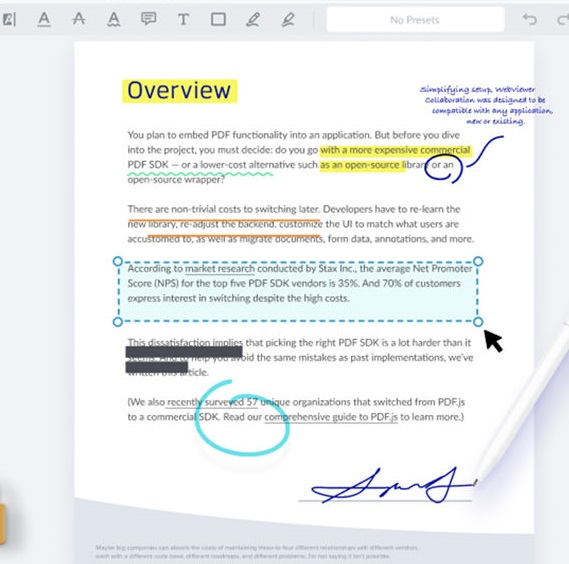

# Moka

This repository hosts the primary codebase for [Moka](https://moka-v2.vercel.app). A publishing and reading app for digital novels, poems, short-stories, comics and books of all types.

Code inspired by [Minsta](https://minsta-app.vercel.app).

## Introduction
When the Gutenberg press was invented, it changed the way stories were told and knowledge was shared. It meant that words weren't exclusive to a few people but was available to anyone anywhere.

Printed books are still sold today, however, digital books are more widely adopted by readers. The challenge with digital books is their easy duplicity leaving writers with few ways to make money off them.

Moka is changing the narrative around digital books, writers publish their works and are guaranteed to make money because they can sell cryptographically secure copies of their books (NFTs) directly to their readers.

Readers buy from and enjoy reading their favourite authors with the e-reader.

## Using Moka
Visit the [website](https://moka-v2.vercel.app) in your browser and connect your testnet wallet.

### Publish & sell a book
As a writer who wants to publish on Moka;
##### Publish
- Visit the [publisher page](https://testnet.mintbase.xyz/contract/mokastore.mintspace2.testnet/mint). 
- Add the details about your book
  - Set the "Amount to Mint" as 25 (that's the current maximum)
  - Set name, description and upload the book cover
  - Set custom tags that apply e.g fiction, non-fiction, comic, horror, sci-fi etc
  - Use the "Forever Document" section to upload the ebook file, it must be in EPUB format. Rename the file to "file-name.epub.pdf" because the upload only accepts PDFs. This will be updated in newer versions.
  - Use the "Custom" section to add values for 
    - "author" with the name of the author e.g "J.K Rowling" or "Stephen King" without quotes
    - "published" with the year it was published e.g "2023", "1993" without quotes
- Click "Mint Me".
##### Put book for sale
- To list book copies for sale.
  - Open the token page
  - Click "Sell"
  - Set the price & number of copies to list (NOTE: make sure you set listing type as "Simple Sale")
- Click "Make Listing"

### Read a book
To read a book, first buy a book. Visit the [website](https://moka-v2.vercel.app) in your browser and connect your testnet wallet.
##### Buy a book
- Select a book 
- Click "Buy"
- Approve the transaction in your wallet

##### Read a book
After you purchase from the Moka store, visit [your book library](https://moka-v2.vercel.app/library) to read the book.

## Components
To build this prototype I used the following tools and platforms.

1. Mintbase NFT store contract
2. Mintbase SDK
3. NEAR Blockchain
4. NEAR BOS
5. Arweave for permanent storage
6. Next.js

### Mintbase NFT contract on NEAR with Storage on Arweave
Mintbase provides audited smart contracts deployed on NEAR that helps anyone create and sell NFTs easily. Mintbase's V2 contracts were used with Arweave as data storage.

### Mintbase JS
On the frontend, the MintbaseJS SDK was used to query and interact with the NFT data on chain. Payment, transfer, verifying ownership and asserting provenance through the contracts.

### NEAR BOS
For writers or publishers, I deployed the publishing app to BOS and it allows writers to publish their books on a fully decentralized frontend layer. That way, they always know what to expect and not have the rules suddenly change.

### Future work
To improve the project I plan to 
- improve the reading experience
- encrypt file storage and also add other anti piracy features
- implement more buying options like pay-per-page, monthly subscription, renting books, gifting books, 
- resale of owned books
- permanent book annotations. Just like with physical books, where you can highlight passages, make doodles, notes or whatever and it becomes a permanent part of your copy, this is similar where the metadata for a particular book can be updated and it'll be transferred with that book if it's ever resold or transferred.



## Setting Up the Project

To start with this project:

1. Clone the repository.
2. If you don't have `yarn` installed, run:

   ```bash
   npm install -g yarn
   ```
   
3. Then, install the required dependencies:

     ```bash
     yarn install
     ```

## Environment Variables

Refer to the **.env.example** file for the environment variables used in this project. 

If you don't set up a `.env` file or environment variables with your provider, the project will retrieve values from the following files:

1. For CSS generation during build: `generate-css.js`
2. For configuration variables: `src/constants.ts`
3. For fallback metadata and text values: `src/fallback.ts`

## Local Development

To run the project locally, use:

  ```bash
  yarn dev
  ```

## Updating Environment Variables

### Running Locally

If you're running your project locally, follow these steps to update your environment variables:

1. Save your changes in the `.env` file.
2. Run `yarn dev` again to apply the updated environment variables.
3. Reload the page to reflect the changes.

### Deployed on Vercel

If you have deployed your project on Vercel, follow these steps to update your environment variables:

1. Log in to your Vercel account.
2. Navigate to the project settings for your deployed app.
3. Update the environment variables in the Vercel dashboard.
4. Trigger a redeployment of your app to apply the changes.

By following these steps, you can ensure that your project uses the updated environment variables.